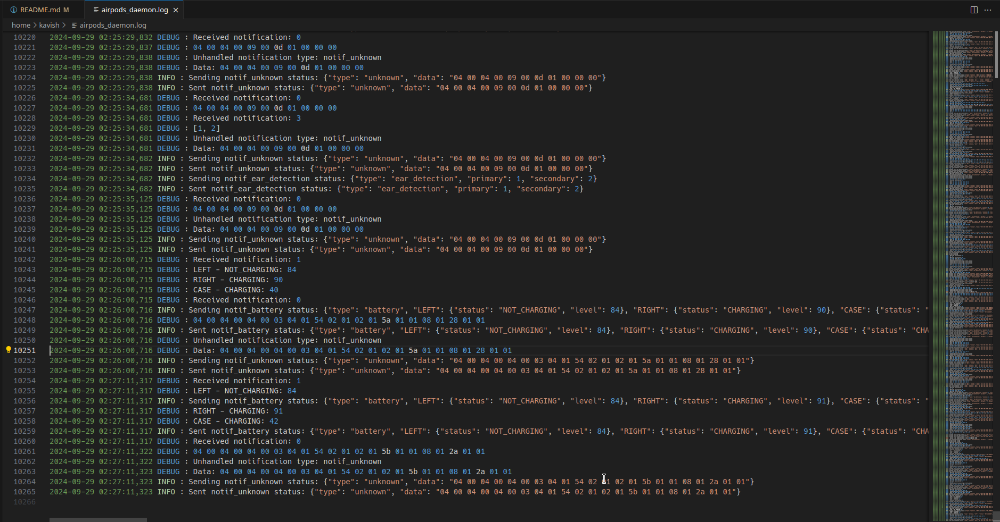
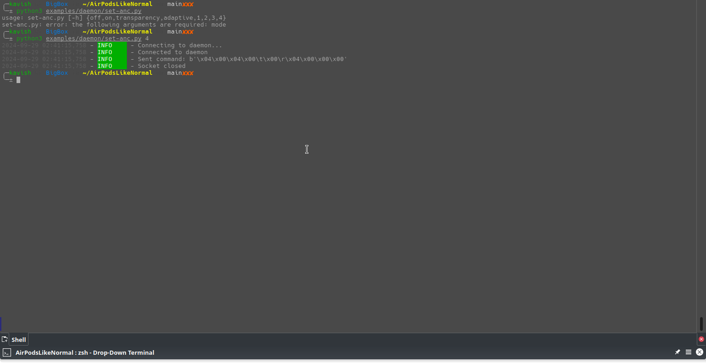
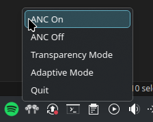

# ALN - AirPods like Normal (Linux Only)

### Check out the packet definitions at [AAP Definitions](/AAP%20Definitions.md)

## Currently supported device(s)
- AirPods Pro 2

### 1. Install the required packages

```bash
sudo apt install python3 python3-pip
pip3 install pybluez
```

If you want to run it as a daemon (Refer to the [Daemon Version](#as-a-daemon-using-a-unix-socket) section), you will need to install the `python-daemon` package.

```bash
pip3 install python-daemon
```

### 2. Clone the repository

```bash
git clone https://github.com/kavishdevar/aln.git
cd aln
```

### 3. Preprare
Pair your AirPods with your machine before running this script!
> **Note:** DO NOT FORGET TO EDIT THE `AIRPODS_MAC` VARIABLE IN EXAMPLE SCRIPTS  WITH YOUR AIRPODS MAC ADDRESS BEFORE RUNNING THEM!

# Versions

## Non-Daemon based
This version is the most polished version of the script. It can do the following:
- fetch the battery percentage,
- fetch in-ear status (but not actually controlling the media with that information).
- control ANC modes
```bash
python3 examples/logger-and-anc.py
```

## As a daemon (using a UNIX socket)

If you want to run a deamon for multiple programs to read/write airpods data, you can use the `airpods_daemon.py` script.
- This creates a standard UNIX socket at `/tmp/airpods_daemon.sock` and listens for commands
- and sends battery/in-ear info
You can run it as follows:

```bash
python3 airpods_daemon.py
```

## Interacting with the daemon

- Sending data to the daemon
You can send data to the daemon using the `set-anc.py` script. Since it's a standard UNIX socket, you can send data to it using any programming language that supports UNIX sockets.

This package includes a demo script that sends a command to turn off the ANC. You can run it as follows:

```bash
python3 examples/daemon/set-anc.py
```

- Reading data from the daemon

You can listen to the daemon's output by running the `read-data.py` script. This script listens to the UNIX socket and prints the data it receives. Currenty, it recognizes the battery percentage and the in-ear status and dumps the rest of the data to the terminal.

```bash
python3 examples/daemon/read-data.py
```

- Controlling the media with the in-ear status (and get battery status)


This script is basically the standalone script, but interacts with the UNIX socket created by the daemon instead. It can control the media with the in-ear status and remove the device as an audio sink when the AirPods are not in your ears.

```bash
python3 examples/daemon/ear-detection.py
```

- App Indicator/Tray Icon



This script is a simple tray icon that shows the battery percentage and set ANC modes. It can also control the media with the in-ear status.
> Note: This script uses QT.

```bash
python3 examples/daemon/tray.py
```

## Standalone version (without module dependency, mainly for testing, and reverse engineering purposes)
- Controlling the media with the in-ear status.
- Remove the device as an audio sink when the AirPods are not in your ears. 
- Try to connect with the AirPods if media is playing and the AirPods are not connected.
- Control ANC modes.
  
```bash
python3 examples/standalone.py
```
